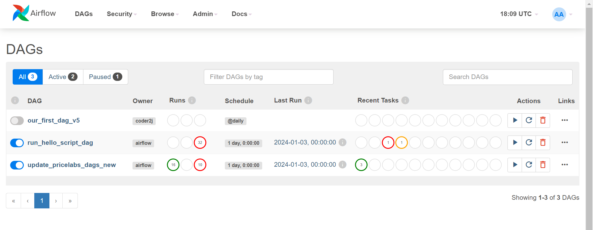
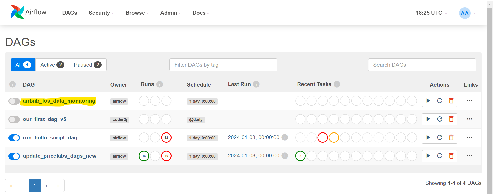

# Airflow Project for deploying tasks using git

## About Airflow

Apache Airflow is an open-source tool for orchestrating complex computational workflows and data processing pipelines. Airflow enables programmers to programmatically author, schedule, and monitor workflows as Directed Acyclic Graphs (DAGs) of tasks. Its functional and modular design makes it a versatile tool for managing task dependencies and timelines efficiently.


## Deployment Using Docker and Docker Compose

We have containerized our Airflow setup using Docker, which simplifies the deployment process and ensures consistency across different environments.

### Building the Docker Image

1. Build the Docker image:
   ```bash
   docker build --no-cache . > build.log 2>&1 --tag my-image:0.0.1
   ```

This command builds a Docker image named `my-image:0.0.1`. The image includes our Airflow setup and all necessary configurations to run the Airflow web app. The `> build.log 2>&1` part of the command redirects both the standard output and standard error to a file named `build.log`, effectively capturing the entire log of the build process. This log can be reviewed later for debugging or verification purposes.

This command builds a Docker image named my-image:0.0.1. The image includes our Airflow setup and all necessary configurations to run the Airflow web app. The "> build.log 2>&1" part of the command redirects both the standard output and standard error to a file named build.log, effectively capturing the entire log of the build process. This log can be reviewed later for debugging or verification purposes.

## Using Docker Compose
To manage the Airflow service with Docker Compose, follow these steps:

### Starting the Airflow Service

To start the Airflow service, use the following command:
   ```bash
   docker compose up airflow-init
   docker compose up
   ```

This command starts the Airflow service as defined in the docker-compose.yml file. Ensure that the docker-compose.yml file specifies the correct image (my-image:0.0.1) that we built in the previous step. Docker Compose will use this image to create and start the Airflow containers.

### Shutting Down the Airflow Service

To shut down the Airflow service, use the following command:

   ```bash
   docker compose down
   ```

This command stops and removes the containers, networks, volumes, and images created by docker-compose up. Note that this does not delete the Docker image (my-image:0.0.1) we created. It only stops the running Airflow service and cleans up the resources used.

## Full reboot

In case you need to start from fresh, you not only need to sutdown the contaners but also delete the docker volumes used by postgress db that is used by airflow to store user logins and tasks metadata

   ```bash
   docker volume ls
   docker volume rm <volume_name>
   ```
Note: usualy the volume would be named: airflow-cron-orchestrator_postgres-db-volume


## Authenticating to git repositories

We utilize SSH for secure authentication to the Bitbucket repository. During the Docker image build process, a private SSH key is used to clone the required repository. This method ensures secure and automated access to our codebase within the containerized environment.

It is important to place the `id_rsa` private SSH key file in the same directory as the Dockerfile before building the Docker image. This allows the Docker build process to access and use the key for cloning the repository. Ensure that this file is kept secure and is not included in version control to prevent unauthorized access.


## Setting Environment Variables

Environment variables, crucial for connecting to databases and managing various configurations, are set during runtime using a `set_env.py` script. This script reads key-value pairs from a JSON file and exports them as environment variables, ensuring that our containerized Airflow instance has all the necessary configurations to connect to external resources and services.

Note: We need to ensure that an `env_var.json` need to be put in the same level as Dockerfile

## Accessing the Airflow Webapp Locally

Once the Docker container is up and running, the Airflow webapp can be accessed locally through the web browser. The default URL is typically `http://localhost:8080`, unless configured otherwise in the Docker setup.

## Directory structure

- build.log                  # Log file generated during Docker image creation.
- dags/                      # Directory containing Airflow DAGs.
- data/                      # Directory where the application/dev repo is pulled from within Docker.
- docker-compose.yaml        # Docker Compose configuration file.
- Dockerfile                 # Dockerfile for building the Airflow Docker image.
- env_var.json               # JSON file containing environment variables, to be placed manually or via CI/CD.
- id_rsa                     # SSH private key for cloning the repository, to be placed manually or via CI/CD.
- logs/                      # Directory for Airflow logs.
- plugins/                   # Directory for Airflow plugins.
- README.md                  # README file for the project.
- scripts/                   # Scripts used in the project.
- set_env.sh                 # Shell script for setting environment variables from `env_var.json`.


## Deploying a task/cron job on airflow

1. Go to airflow url on any browser. If webapp hosted locally: http://localhost:8080/home
2. Click on 'DAGs' tab from the menue bar.


3. You can see all the tasks deployed, ensure the task: 'update_dags_new' is synched.
4. Push the new dag and task script to the active repo for your app or service.
5. Trigger the task 'update__dags_new. This will pull the latest changes from app repo and if any cron script(and dag script) is found, it will create the dag task in the airflow.
6. Wait 5 minutes for dag task to show up on UI as below




